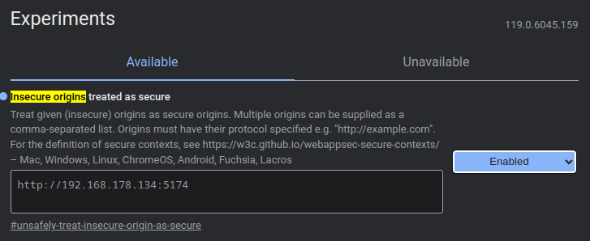
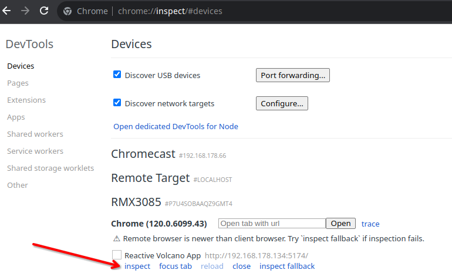

<div align="center">

# Reactive Vaporizer App


[](https://github.com/firsttris/reactive-volcano-app/actions/workflows/build.yml)
[](https://creativecommons.org/licenses/by-nc/4.0/)

[](https://www.solidjs.com/)
[](https://www.typescriptlang.org/)
[](https://vitejs.dev/)
[](https://styled-components.com/)

**Control your Storz & Bickel devices with cutting-edge Web Bluetooth technology.**

[German Version](README_de.md)

</div>


## 📖 Introduction

The Volcano, Venty, Veazy, and Crafty, made by Storz & Bickel in Tuttlingen, Germany, are well-known high-quality vaporizers. These devices can be controlled using the Bluetooth Web API.

This project showcases how to use **cutting-edge technology** to control these devices via the Web Bluetooth API.

## 📱 Device Support

This app supports the following Storz & Bickel devices:

- **Volcano**
- **Venty**
- **Veazy**
- **Crafty** (both new and old firmware versions)

*Note: Available features may vary depending on the device model.*

## 🚀 Features

### App Features
- 🌑 **Dark mode**
- 📱 **Responsive UI** (Desktop & Mobile)
- 🌍 **Localization** (German & English)
- 💾 **PWA** (Progressive Web App)

## 🎮 Test my App

Access & Test the WebApp here: **[Reactive Vaporizer App](https://firsttris.github.io/reactive-volcano-app/)**

## 🐧 Prerequisites

Make sure the **Web Bluetooth API** is activated in your browser.

1. Open Chrome and navigate to `chrome://flags/#enable-web-bluetooth`.
2. Enable the flag as shown in the image below.


## 🖼️ User Interface Overview

<details>
<summary><b>Click to view User Interface screenshots</b></summary>
<br>

The user interface is responsive and designed to work well on both desktop and mobile devices.

### Click on the Bluetooth icon to initiate Bluetooth discovery
<div align="center">


</div>

### Effortlessly control your Storz & Bickel device
<div align="center">


</div>

### Veazy Venty
<div align="center">


</div>

</details>

## 📲 Adding the PWA to Your Home Screen

<details>
<summary><b>Click to see PWA installation steps</b></summary>
<br>

Progressive Web Apps can be installed on your device like native apps.

### On Android:
1. Open the PWA in your browser (Chrome, Firefox, etc.).
2. Tap on the browser's menu (usually three dots in the top right corner).
3. Tap on "Add to Home screen".

### On iOS:
1. Open the PWA in Safari.
2. Tap the Share button (the box with an arrow pointing upwards).
3. Scroll down and tap "Add to Home Screen".

</details>


## 🛠️ Development and Build

<details>
<summary><b>Click to see Development and Build steps</b></summary>
<br>

To develop and build this project, follow these steps:

1. Clone the repository:
   ```bash
   git clone https://github.com/firsttris/reactive-volcano-app.git
   ```
2. Navigate into the project directory:
   ```bash
   cd reactive-volcano-app
   ```
3. Install the dependencies:
   ```bash
   npm install
   ```
4. Start the development server:
   ```bash
   npm run dev
   ```
5. To build the project:
   ```bash
   npm run build
   ```

</details>

### 🐛 Remote Debugging on Android

<details>
<summary><b>Click to see Remote Debugging steps</b></summary>
<br>

1. **Enable USB Debugging** on your Android device.
2. **Connect Your Device** via USB.
3. **Enable Bluetooth Web API for HTTP**: Go to `chrome://flags/#unsafely-treat-insecure-origin-as-secure` in Chrome on your PC.
4. **Enter Your Local IP Address**: Add your local dev machine IP, enable, and restart.
   
5. **Open Local Server URL**: Open `http://<YOUR_IP>:5174/` on your Android device.
6. **Enable Remote Debugging**: On your PC, go to `chrome://inspect/#devices`.
   
7. **Debug**: Click "inspect" to open the DevTools.

</details>

## ⚠️ Connection Issues and Pitfalls

- **Single Connection**: The Volcano can maintain a Bluetooth connection with only one device at a time. Disconnect existing connections before pairing a new device.

## 🤝 Contributing

Want to contribute?
- Visit our [issues page](https://github.com/firsttris/reactive-volcano-app/issues).
- Submit pull requests or open issues for bugs and feature suggestions.

## ⚖️ Code Ownership & License

**Code Ownership**:
This project has been developed with utmost care to respect Storz & Bickel's rights. All code was written from scratch using different technologies. Assets are open source. If existing concerns arise, please contact me before taking legal action.

**License**:
This work is licensed under a [Creative Commons Attribution-NonCommercial 4.0 International License](http://creativecommons.org/licenses/by-nc/4.0/).
