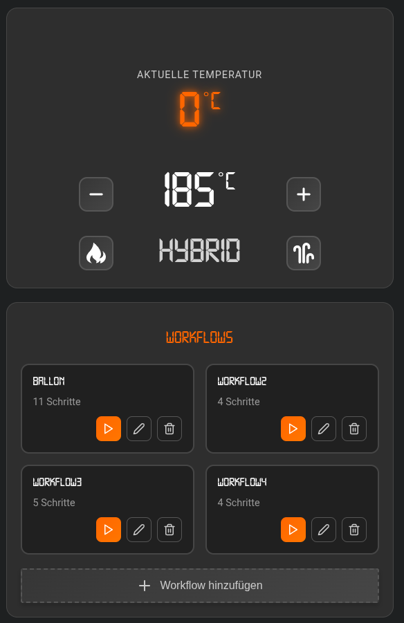
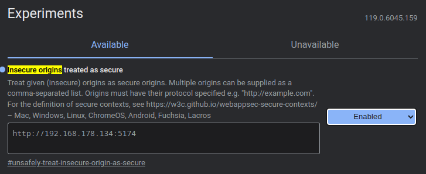
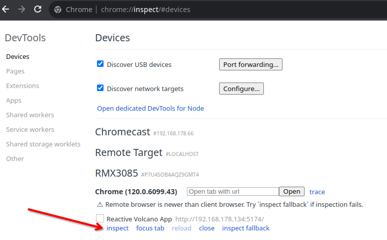

<div align="center">

# Reactive Vaporizer App



[](https://github.com/firsttris/reactive-volcano-app/actions/workflows/build.yml)
[](https://creativecommons.org/licenses/by-nc/4.0/)

[](https://www.solidjs.com/)
[](https://www.typescriptlang.org/)
[](https://vitejs.dev/)
[](https://styled-components.com/)

**Steuern Sie Ihre Storz & Bickel Geräte mit modernster Web Bluetooth Technologie.**

</div>


## 📖 Einführung

Der Volcano, Venty, Veazy und Crafty, hergestellt von Storz & Bickel in Tuttlingen, Deutschland, sind bekannte hochwertige Vaporizer. Diese Geräte können über die Bluetooth Web API gesteuert werden.

Dieses Projekt zeigt, wie man **modernste Technologie** nutzt, um diese Geräte über die Web Bluetooth API zu steuern.

## 📱 Geräteunterstützung

Diese App unterstützt die folgenden Storz & Bickel Geräte:

- **Volcano**
- **Venty**
- **Veazy**
- **Crafty** (Sowohl neue als auch alte Firmware-Versionen)

*Hinweis: Verfügbare Funktionen können je nach Gerätemodell variieren.*

## 🚀 Funktionen

### App-Funktionen
- 🌑 **Dunkelmodus**
- 📱 **Responsive UI** (Desktop- und Mobilgeräte)
- 🌍 **Lokalisierung** (Deutsch und Englisch)
- 💾 **PWA** (Progressive Web App)

## 🎮 Testen Sie meine App

Greifen Sie auf meine WebApp zu und testen Sie sie hier: **[Reactive Vaporizer App](https://firsttris.github.io/reactive-volcano-app/)**

## 🐧 Voraussetzungen

Stellen Sie sicher, dass die **Web Bluetooth API** in Ihrem Browser aktiviert ist.

1. Öffnen Sie Chrome und navigieren Sie zu `chrome://flags/#enable-web-bluetooth`.
2. Aktivieren Sie das Flag wie im Bild unten gezeigt.


## 🖼️ Benutzeroberfläche Übersicht

<details>
<summary><b>Klicken Sie hier, um Screenshots der Benutzeroberfläche anzuzeigen</b></summary>
<br>

Die Benutzeroberfläche ist responsiv und für Desktop- und Mobilgeräte optimiert.

### Klicken Sie auf das Bluetooth-Symbol, um die Bluetooth-Suche zu starten
<div align="center">


</div>

### Steuern Sie mühelos Ihr Storz & Bickel Gerät
<div align="center">


</div>

### Veazy Venty
<div align="center">


</div>

</details>

## 📲 Hinzufügen der PWA zu Ihrem Startbildschirm

<details>
<summary><b>Klicken, um Schritte zum Hinzufügen der PWA anzuzeigen</b></summary>
<br>

Progressive Web Apps können wie native Apps auf Ihrem Gerät installiert werden.

### Auf Android:
1. Öffnen Sie die PWA in Ihrem Browser (Chrome, Firefox usw.).
2. Tippen Sie auf das Browser-Menü (normalerweise drei Punkte in der oberen rechten Ecke).
3. Tippen Sie auf "Zum Startbildschirm hinzufügen".

### Auf iOS:
1. Öffnen Sie die PWA in Safari.
2. Tippen Sie auf die Teilen-Schaltfläche (das Feld mit einem nach oben zeigenden Pfeil).
3. Scrollen Sie nach unten und tippen Sie auf "Zum Startbildschirm hinzufügen".

</details>


## 🛠️ Entwicklung und Build

<details>
<summary><b>Klicken, um Schritte für Entwicklung und Build anzuzeigen</b></summary>
<br>

Um dieses Projekt zu entwickeln und zu bauen, folgen Sie diesen Schritten:

1. Klonen Sie das Repository:
   ```bash
   git clone https://github.com/firsttris/reactive-volcano-app.git
   ```
2. Navigieren Sie in das Projektverzeichnis:
   ```bash
   cd reactive-volcano-app
   ```
3. Installieren Sie die Abhängigkeiten:
   ```bash
   npm install
   ```
4. Starten Sie den Entwicklungsserver:
   ```bash
   npm run dev
   ```
5. Um das Projekt zu bauen:
   ```bash
   npm run build
   ```

</details>

### 🐛 Remote-Debugging auf Android

<details>
<summary><b>Klicken, um Schritte für Remote-Debugging anzuzeigen</b></summary>
<br>

1. **USB-Debugging aktivieren** auf Ihrem Android-Gerät.
2. **Gerät verbinden** über USB.
3. **Bluetooth Web API für HTTP aktivieren**: Gehen Sie zu `chrome://flags/#unsafely-treat-insecure-origin-as-secure` in Ihrem Chrome-Browser auf dem PC.
4. **Geben Sie Ihre lokale IP-Adresse ein**: Fügen Sie die IP Ihres Entwicklungsrechners hinzu, aktivieren Sie die Option und starten Sie Chrome neu.
   
5. **Öffnen Sie die URL Ihres lokalen Servers**: Öffnen Sie `http://<IHRE_IP>:5174/` auf Ihrem Android-Gerät.
6. **Remote-Debugging aktivieren**: Gehen Sie auf Ihrem PC zu `chrome://inspect/#devices`.
   
7. **Debuggen**: Klicken Sie auf "inspect", um die DevTools zu öffnen.

</details>

## ⚠️ Verbindungsprobleme und Fallstricke

- **Einzelverbindung**: Der Volcano kann nur eine Bluetooth-Verbindung gleichzeitig aufrechterhalten. Trennen Sie bestehende Verbindungen, bevor Sie ein neues Gerät koppeln.

## 🤝 Mitwirken

Möchten Sie zu diesem Projekt beitragen?
- Besuchen Sie unsere [Issues-Seite](https://github.com/firsttris/reactive-volcano-app/issues).
- Fühlen Sie sich frei, Pull-Requests einzureichen oder Issues für Bugs und Feature-Vorschläge zu öffnen.

## ⚖️ Code-Eigentum & Lizenz

**Code-Eigentum**:
Dieses Projekt wurde mit größter Sorgfalt entwickelt, um die Rechte von Storz & Bickel zu respektieren. Der gesamte Code wurde von Grund auf neu geschrieben. Assets sind Open Source. Falls Bedenken bestehen, kontaktieren Sie mich bitte vor rechtlichen Schritten.

**Lizenz**:
Diese Arbeit ist derzeit unter einer [Creative Commons Attribution-NonCommercial 4.0 International License](http://creativecommons.org/licenses/by-nc/4.0/) lizenziert.