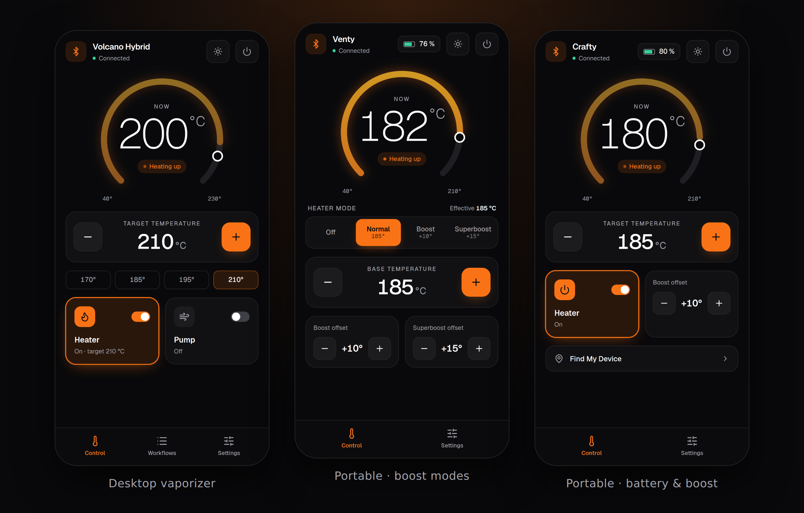
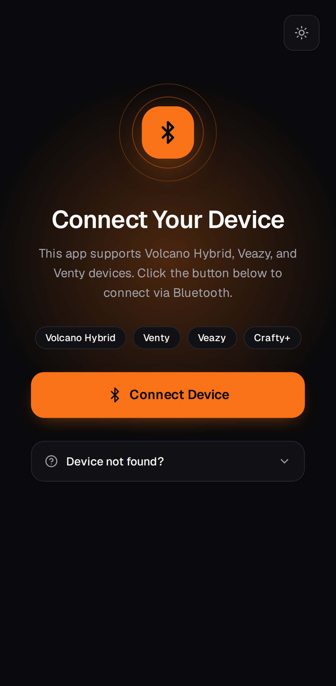
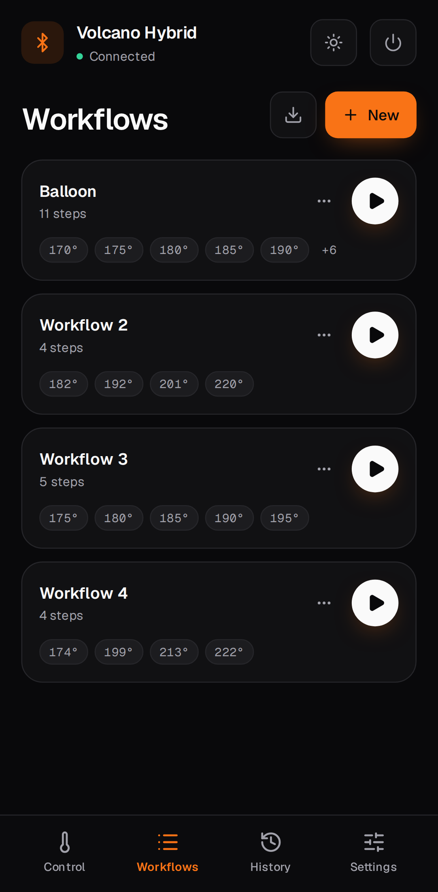
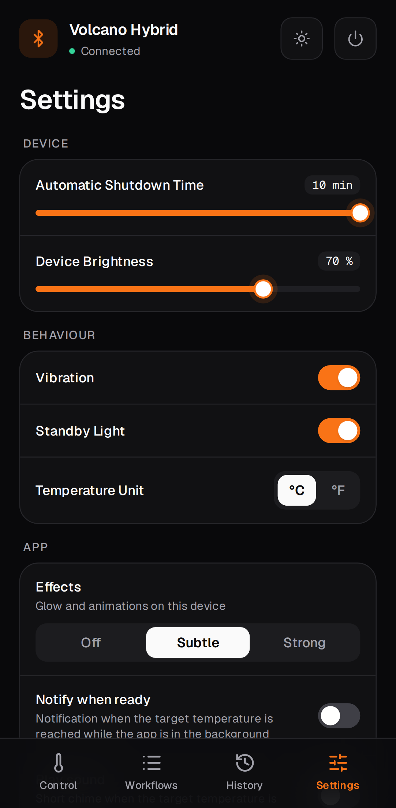
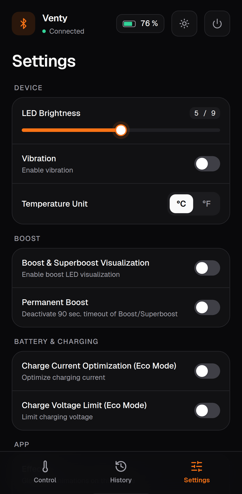
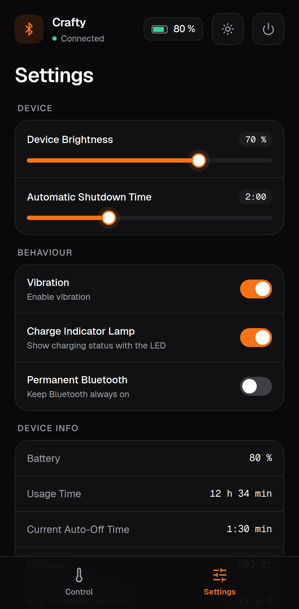
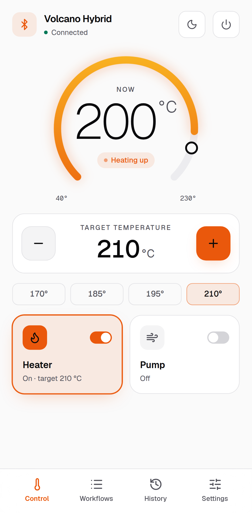

<div align="center">

# Reactive Volcano App

**Steuere deinen Vaporizer direkt aus dem Browser.**<br>
Inoffizielle Web-Bluetooth-App für Volcano Hybrid, Venty, Veazy und Crafty von Storz & Bickel:
Live-Temperatur, Heizung und Pumpe, Aufheiz-Workflows, Geräteeinstellungen und Selbstdiagnose.<br>
Kein App-Store, kein Konto, kein Server: Seite öffnen, verbinden, fertig.

[](https://github.com/firsttris/reactive-volcano-app/actions/workflows/build.yml)
[](https://github.com/firsttris/reactive-volcano-app/actions/workflows/release.yml)
[](https://hub.docker.com/r/tristanteu/reactive-volcano-app)
[](https://hub.docker.com/r/tristanteu/reactive-volcano-app)
[](https://hub.docker.com/r/tristanteu/reactive-volcano-app/tags)
[](LICENSE)
<br>
[](https://www.solidjs.com/)
[](https://www.typescriptlang.org/)
[](https://vite.dev/)
[](https://tailwindcss.com/)
[](docs/getting-started.md#install-as-an-app)

[**▶ App öffnen**](https://firsttris.github.io/reactive-volcano-app/) •
[Warum?](#-warum) •
[Funktionen](#-funktionen) •
[Loslegen](#-loslegen) •
[Selbst hosten](#-selbst-hosten) •
[Dokumentation](docs/README.md) •
[Entwicklung](#️-entwicklung)



<sub>English: [README.md](README.md)</sub>

</div>

> [!IMPORTANT]
> **Inoffizielles, unabhängiges Projekt.** Es steht in keiner Verbindung zur Storz & Bickel GmbH und
> wird von ihr weder unterstützt noch autorisiert. *VOLCANO*, *VENTY*, *VEAZY*, *CRAFTY* und
> *STORZ & BICKEL* sind Marken ihres jeweiligen Inhabers und werden hier nur genannt, um zu beschreiben,
> mit welchen Geräten die App kompatibel ist. Offizielle App, Firmware und Support gibt es beim
> Hersteller. Siehe [Rechtliche Hinweise](docs/legal.md).

## 💡 Warum?

Volcano Hybrid, Venty, Veazy und Crafty sprechen Bluetooth Low Energy, und moderne Browser können über
die [Web Bluetooth API](https://developer.mozilla.org/docs/Web/API/Web_Bluetooth_API) direkt mit ihnen
reden. Dieses Projekt macht daraus eine schnelle, aufgeräumte App, die überall läuft, wo Chrome oder
Edge läuft, als Alternative zur App des Herstellers:

- **Nichts zu installieren**: eine Webseite, die auf Wunsch als App auf dem Startbildschirm landet.
  Läuft auf Android, Windows, macOS, ChromeOS und Linux, auf iOS mit einem Web-Bluetooth-Browser.
- **Live**: Temperatur und Zustand kommen als Bluetooth-Benachrichtigung, sobald das Gerät sie sendet
  (Handgeräte mit nur einem Steuerkanal werden zweimal pro Sekunde abgefragt), und jede Änderung ist in
  Sekundenbruchteilen geschrieben.
- **Workflows**: automatisiere eine Session am Tischgerät: auf 170 °C heizen, halten, Pumpe laufen
  lassen, auf 175 °C erhöhen und so weiter. Eigene Abläufe bauen und als JSON teilen.
- **Privat von Grund auf**: Es gibt kein Backend. Die App spricht nur mit deinem Gerät, speichert ihre
  Daten in deinem Browser und hat kein Tracking, keine Analyse und keine Konten.
- **Offen und selbst hostbar**: ein kleiner nginx-Container für amd64 und arm64 oder jeder statische
  Webserver.

## ✨ Funktionen

| | Tischgerät · *Volcano Hybrid* | Handgerät · *Venty* / *Veazy* | Handgerät · *Crafty / Crafty+* |
|---|:---:|:---:|:---:|
| 🌡️ Aktuelle und Zieltemperatur live, mit Aufheizfortschritt | ✅ | ✅ | ✅ |
| 🔥 Heizung an/aus | ✅ | ✅ | ✅ |
| 💨 Luftpumpe an/aus | ✅ | | |
| 🚀 Boost- und Superboost-Offsets, Heizmodi | | ✅ | Boost |
| 🔁 Workflows: mehrstufig Heizen / Halten / Pumpen, JSON-Import & -Export | ✅ | | |
| 🔋 Akkustand und Ladezustand | | ✅ | ✅ |
| 🔆 Helligkeit, Vibration, °C / °F | ✅ | ✅ | ✅ |
| ⏱️ Abschaltzeit | ✅ | | ✅ |
| 🔌 Öko-Laden (Ladestrom, Ladespannung), Dauer-Boost | | ✅ | |
| 📶 Bluetooth dauerhaft an | | Veazy | ✅ |
| 💡 Lade-LED | | | ✅ |
| 📍 Gerät finden | | Veazy | Crafty+ |
| 🩺 Selbstdiagnose mit verständlichen Hinweisen | ✅ | ✅ | ✅ |
| ℹ️ Seriennummer, Firmware, Betriebszeit | ✅ | ✅ | ✅ |
| ♻️ Werkseinstellungen | | ✅ | ✅ |

Crafty-Geräte mit Firmware älter als 2.51 liefern weniger Werte: Ziel- und aktuelle Temperatur,
Boost, Helligkeit und Akku funktionieren, der Rest wird ausgeblendet.

**In der ganzen App**: hell und dunkel (folgt dem System), Deutsch und Englisch (folgt dem Browser),
installierbare PWA mit Offline-Start, der Bildschirm bleibt an, solange geheizt wird oder ein Workflow
läuft, klare Meldungen, wenn die Verbindung abreißt. Jede Seite ist in der
[Bedienung](docs/usage.md) beschrieben (englisch).

## 📸 Screenshots

<table>
  <tr>
    <td width="33%"><br><sub><b>Verbinden</b>: ein Tipp, mit Hilfe, falls nichts gefunden wird</sub></td>
    <td width="33%"><br><sub><b>Workflows</b>: starten, bearbeiten, importieren, exportieren</sub></td>
    <td width="33%"><br><sub><b>Einstellungen</b>: Optionen, Infos und Diagnose</sub></td>
  </tr>
  <tr>
    <td><br><sub><b>Handgerät</b>: Boost und Öko-Laden</sub></td>
    <td><br><sub><b>Crafty</b>: Abschaltzeit, LED, Bluetooth</sub></td>
    <td><br><sub><b>Hell</b>: folgt deinem System</sub></td>
  </tr>
</table>

## 🚀 Loslegen

1. **[firsttris.github.io/reactive-volcano-app](https://firsttris.github.io/reactive-volcano-app/)**
   in Chrome, Edge oder Opera öffnen.
2. Gerät einschalten und sicherstellen, dass es **nicht mit einem anderen Handy oder einer anderen App
   verbunden** ist.
3. **Gerät verbinden** tippen und das Gerät im Bluetooth-Dialog des Browsers auswählen.

### 🌐 Browser

| Plattform | Funktioniert mit | Hinweis |
|---|---|---|
| Android, Windows, macOS, ChromeOS | Chrome, Edge, Opera | Web Bluetooth ist standardmäßig an |
| Linux | Chrome, Chromium | einmal `chrome://flags/#enable-web-bluetooth` aktivieren, siehe [Getting started](docs/getting-started.md#linux) |
| iOS, iPadOS | [Bluefy](https://apps.apple.com/app/bluefy-web-ble-browser/id1492822055) | Safari kann kein Web Bluetooth |
| Firefox, Safari | ❌ | kein Web Bluetooth |

Gerät wird nicht gefunden? Die [Fehlersuche](docs/troubleshooting.md) beginnt mit Chromes eingebauter
Seite `chrome://bluetooth-internals` und zeigt in drei Schritten, ob Adapter, Browser oder Gerät das
Problem ist.

## 🐳 Selbst hosten

Ein fertiges Image für `linux/amd64` und `linux/arm64` liegt auf
[Docker Hub](https://hub.docker.com/r/tristanteu/reactive-volcano-app):

```bash
docker run -d --name vaporizer-app -p 8080:8080 --restart unless-stopped tristanteu/reactive-volcano-app:latest
```

Der Container betreibt nginx ohne Root-Rechte und lauscht auf Port **8080** (ältere Images: 80, siehe
[Aktualisieren](docs/self-hosting.md#updates)).

<details>
<summary><b>Docker Compose</b></summary>

```yaml
services:
  vaporizer-app:
    image: tristanteu/reactive-volcano-app:latest
    ports:
      - "8080:8080"
    restart: unless-stopped
```

</details>

<details>
<summary><b>Podman Quadlet</b></summary>

```bash
curl -o ~/.config/containers/systemd/volcano-app.container \
  https://raw.githubusercontent.com/firsttris/reactive-volcano-app/main/volcano-app.container
systemctl --user daemon-reload && systemctl --user start volcano-app
```

</details>

> [!NOTE]
> Browser erlauben Bluetooth nur in einem **sicheren Kontext**: `https://…` oder `http://localhost`.
> Wer seine Instanz von einem anderen Gerät aus nutzen will, braucht einen Reverse Proxy mit HTTPS.
> Beispiele für Caddy, nginx und Traefik und den Betrieb unter einem Unterpfad stehen in
> [Self-hosting](docs/self-hosting.md).

## 📚 Dokumentation

Die ausführliche Dokumentation ist auf Englisch: [docs/README.md](docs/README.md), auch als Website
mit Suche: **https://firsttris.github.io/reactive-volcano-app/docs/**

| | |
|---|---|
| [Getting started](docs/getting-started.md) | Browser, Linux-Flag, iOS, Verbinden, als App installieren, Updates |
| [Usage](docs/usage.md) | jede Seite je Gerät: Steuerung, Boost, Einstellungen, Diagnose, Gerät finden |
| [Workflows](docs/workflows.md) | Ablauf eines Workflows, Bearbeiten, JSON-Format für Import und Export |
| [Self-hosting](docs/self-hosting.md) | Docker, Compose, Podman, HTTPS mit Caddy / nginx / Traefik, Unterpfade |
| [Troubleshooting & FAQ](docs/troubleshooting.md) | Gerät nicht gefunden, Verbindungsabbrüche, Linux, iOS, häufige Fragen |
| [Privacy & security](docs/privacy-security.md) | was die App speichert, was sie sendet (nichts), Berechtigungen |
| [Architecture](docs/architecture.md) | Schichten, Datenfluss, Bluetooth-Queue, Stores, Routing, PWA, Entscheidungen |
| [Bluetooth protocol](docs/protocol.md) | Services, Characteristics und Kodierung je Gerätefamilie |
| [Development](docs/development.md) | Einrichtung, Skripte, Projektstruktur, Konventionen, Übersetzungen, neues Gerät |
| [Testing](docs/testing.md) | Unit-Tests, Bluetooth-Mock, End-to-End-Tests, Screenshots, CI |
| [Releases & deployment](docs/releases.md) | GitHub Pages, Versionen, Docker-Images, Release-Workflow |
| [Legal notice](docs/legal.md) | Marken, keine Verbindung zum Hersteller, keine Gewährleistung, Sicherheit, Lizenz |

## 🛠️ Entwicklung

Voraussetzung: Node.js 22 oder neuer.

```bash
git clone https://github.com/firsttris/reactive-volcano-app.git && cd reactive-volcano-app
npm install
npm run dev        # http://localhost:5173
```

Kein Gerät zur Hand? Die End-to-End-Tests lassen die ganze App gegen einen simulierten
Web-Bluetooth-Stack laufen; mit `npm run test:e2e:ui` kann man sich durchklicken.

**Stack**: SolidJS mit `@solidjs/router` · Tailwind CSS 4 und [solid-ui](https://www.solid-ui.com)
(Kobalte) · Paraglide JS für Deutsch und Englisch · `p-queue`, das jeden GATT-Zugriff serialisiert ·
`vite-plugin-pwa` · Vitest, Playwright und Biome. Mehr in [Development](docs/development.md) und
[Architecture](docs/architecture.md).

```bash
npm run typecheck && npm run lint && npm test && npm run test:e2e
```

## 🤝 Mitwirken

Fehlerberichte, Ideen und Pull Requests sind willkommen, siehe [CONTRIBUTING.md](CONTRIBUTING.md).
Am meisten helfen Rückmeldungen von echten Geräten: bitte Gerät, Firmware-Version (unter
*Einstellungen*), Browser und Betriebssystem angeben.

---

<div align="center">
<sub>
<a href="LICENSE">CC BY-NC 4.0</a> · © Tristan Teufel und Mitwirkende · <a href="README.md">English version</a><br>
Unabhängiges, inoffizielles Open-Source-Projekt. Es steht in keiner Verbindung zur Storz &amp; Bickel GmbH und wird von ihr weder unterstützt, gesponsert noch autorisiert.<br>
STORZ &amp; BICKEL, VOLCANO, VOLCANO HYBRID, VENTY, VEAZY und CRAFTY sind Marken der Storz &amp; Bickel GmbH und werden nur zur Beschreibung der Kompatibilität genannt.<br>
Bereitgestellt „wie besehen“, ohne Gewährleistung. Nutzung auf eigene Gefahr. <a href="docs/legal.md">Rechtliche Hinweise</a>
</sub>
</div>
