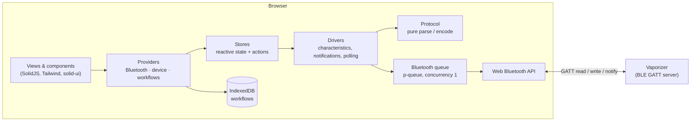
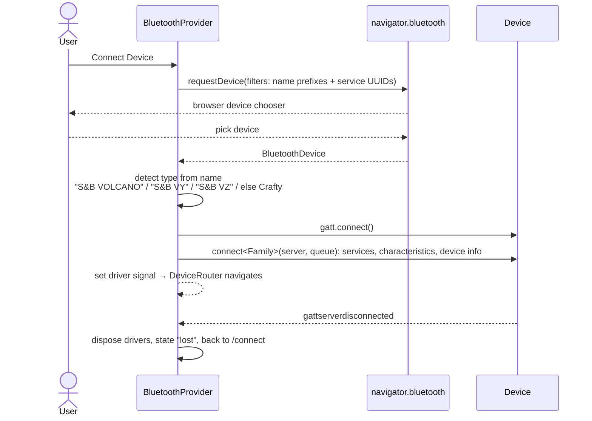
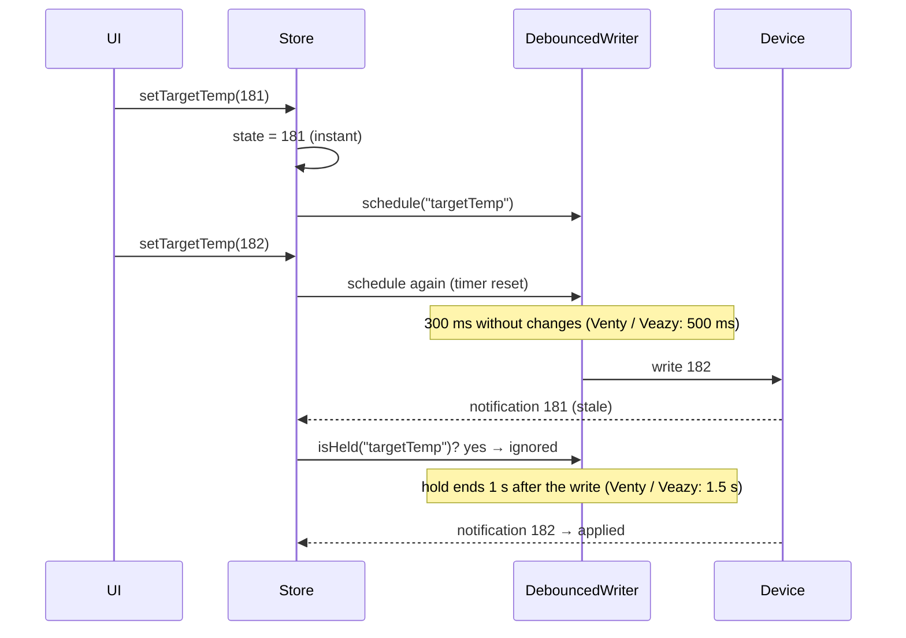

# Architecture

The app is a client-only single-page application. Everything, including the Bluetooth protocol, runs in
the browser; there is no server component. This page explains how it is put together and why.

## Contents

- [Overview](#overview)
- [Layers](#layers)
- [Connecting](#connecting)
- [The Bluetooth queue](#the-bluetooth-queue)
- [Device modules](#device-modules)
- [Writing values](#writing-values)
- [Routing and providers](#routing-and-providers)
- [Workflows](#workflows)
- [UI](#ui)
- [Internationalization](#internationalization)
- [PWA and offline](#pwa-and-offline)
- [Build and runtime targets](#build-and-runtime-targets)
- [Design decisions](#design-decisions)

## Overview



## Layers

Each device family is built from the same four layers, from the bytes up:

| Layer | Files | Responsibility | Depends on |
|---|---|---|---|
| **Protocol** | `src/devices/<family>/protocol.ts` | pure functions: parse `DataView`s into values, encode values into `ArrayBuffer`s, bit masks, limits, the self-diagnosis rules | nothing (unit-tested with byte fixtures) |
| **Driver** | `src/devices/<family>/driver.ts` | finds services and characteristics, reads, writes, subscribes to notifications or polls, emits typed updates | protocol, Web Bluetooth, queue |
| **Store** | `src/devices/<family>/store.ts` | a Solid store with the device state, user actions (`setTargetTemp`, `setHeater` …) and derived values (`isHeating`); debounces writes | driver, `solid-js/store` |
| **Provider / views** | `src/provider/*Provider.tsx`, `src/Views`, `src/components` | make the store available to a route subtree and render it | store |

Shared building blocks live in `src/devices/shared/`:

- `characteristicDevice.ts`: generic driver core for devices that expose one characteristic per value
  (desktop and Crafty): initial reads, notification wiring, queued writes, `writeSequence` for several
  writes without anything in between, clean `dispose()`.
- `debouncedWriter.ts`: write-after-pause and the "hold" window described [below](#writing-values).
- `analysis.ts`: the finding types and the support-report format for the self-diagnosis.

## Connecting

`BluetoothProvider` (`src/provider/BluetoothProvider.tsx`) owns the connection:



- **Filters**: name prefixes `STORZ&BICKEL`, `Storz&Bickel`, `S&B`, plus the service UUIDs of each
  family. On iOS (Bluefy, WebBLE) only name filters are used because service filters are not supported
  there.
- **Type detection** is by advertised name. The Venty / Veazy serial number is the second word of the
  name (`S&B VY123456`).
- **One driver per family** is held in a signal (`volcanoDriver`, `ventyVeazyDriver`, `craftyDriver`).
  Device providers subscribe to "their" signal; everything else only sees `deviceInfo` and
  `connectionState`.
- **Errors**: closing the chooser (`NotFoundError`) is not reported. Every other failure becomes a
  `ConnectionError` (`failed` with a message, or `lost`) that the connect screen shows.
- **Cleanup**: on disconnect or failure, drivers are disposed (notifications stopped, listeners removed,
  timers cleared) before the GATT connection is dropped.

## The Bluetooth queue

Web Bluetooth implementations reject or silently drop a GATT operation while another one is in flight
("GATT operation already in progress"). Instead of handling that in every component, **every** GATT call,
including `getPrimaryService`, `getCharacteristic`, `readValue`, `writeValue` and
`startNotifications`, goes through one global queue:

```ts
// src/utils/bluetoothQueue.ts
export const bluetoothQueue = new PQueue({ concurrency: 1 });
```

The queue is passed into each `connect<Family>()` function and driver, which keeps drivers testable
(tests pass their own queue and fake characteristics).

## Device modules

| | Desktop (`devices/volcano`) | Crafty (`devices/crafty`) | Venty / Veazy (`devices/ventyVeazy`) |
|---|---|---|---|
| GATT layout | one characteristic per value, two services (state, control) | one characteristic per value, three services | **one** control characteristic, command frames |
| Updates | notifications | notifications | request / response, status polled every 500 ms, usage times every 30th poll |
| Temperatures | uint16 / uint32 in 1/10 °C | uint16 in 1/10 °C | uint16 in 1/10 °C inside a 20-byte frame |
| Switches | dedicated on / off characteristics; register bits via a 32-bit "set / clear bit" write | dedicated heater on / off; registers read-modify-write | bits + write mask in the STATUS frame |
| Variants | | old firmware (< 2.51) with fewer characteristics; Crafty+ (≥ 3.x) | Venty vs Veazy: some bits inverted or model-only |

The byte-level details are documented in [Bluetooth protocol](protocol.md).

## Writing values

Two problems meet when a user changes a number on a BLE device:

1. A + button pressed ten times would cause ten writes queued behind each other.
2. The device echoes intermediate values back as notifications, which would make the number on screen
   jump back while the user is still clicking.

`createDebouncedWriter` solves both per field:



Switches (heater, pump, options) are not debounced: the store updates optimistically and writes at
once; the next notification or read-back confirms the value. Workflows use `applyTargetTemp`, which
writes immediately and awaits the write.

## Routing and providers

```
/                         DeviceRouter → redirects by connection state and device type
/connect                  Connect
/device/volcano           WorkflowWrapper: WorkflowProvider › VolcanoProvider › WorkflowRunnerProvider › DeviceShell
  /                       VolcanoView (control)
  /workflows              WorkFlowSection (list)
  /workflow/list/:id      WorkflowList (steps)
  /workflow/form/:id/:sid WorkflowForm (edit a step)
  /settings               VolcanoSettingsView
/device/venty-veazy       VentyVeazyShell: VentyVeazyProvider › DeviceShell
  /  ·  /settings
/device/crafty            CraftyShell: CraftyProvider › DeviceShell
  /  ·  /settings
```

- Route constants and typed builders live in `src/routes.ts` (`ROUTES`, `buildRoute`); components never
  hard-code paths.
- The router's `base` comes from Vite's `BASE_URL`, so the same code runs at `/` and under
  `/reactive-volcano-app/`.
- Device shells redirect to `/` when the connection is gone, so a reload on a device URL ends on the
  connect screen.
- App-wide providers in `src/index.tsx`: `DarkModeProvider › ToastProvider › BluetoothProvider`.
- Device providers render their children only once a driver exists and create the store inside the
  provider's owner, so the store's `onCleanup` unsubscribes from the driver when the route unmounts.

## Workflows

- **Data**: `useWorkflow` (`src/hooks/volcano/useWorkflow.ts`) keeps the workflow list and the selected
  workflow in IndexedDB through `useIndexedDB` (one key-value store, `VolcanoWorkflowDB`). It also
  implements JSON import and export.
- **Execution**: `useWorkflowScheduler` (`src/hooks/volcano/useWorkflowScheduler.ts`) runs the steps
  against the desktop store. Every run gets an id; pause and stop increment it and reject all pending
  delays, so a cancelled run can never switch the heater or pump afterwards.
- **Scope**: `WorkflowRunnerProvider` sits above all desktop routes, so a running workflow survives
  navigation between control, workflows and settings and its status bar stays visible. It also holds
  the screen wake lock while a workflow runs or the heater is on.

Behaviour and file format from a user's view: [Workflows](workflows.md).

## UI

- **SolidJS** with fine-grained reactivity: a notification updates one store field and re-renders only
  the text nodes that read it. No virtual DOM, small bundle.
- **Tailwind CSS 4** with design tokens as CSS variables in `src/css/main.css` (light and dark sets,
  orange primary), **solid-ui** components (`src/components/ui`, generated from the shadcn-style
  registry, built on **Kobalte** for accessible primitives), **lucide-solid** icons imported per icon.
- **Fonts**: Geist and Geist Mono, bundled through Fontsource; no external font requests.
- **Dark mode**: a class on `<html>`, set before first paint by an inline script in `index.html`
  (no flash), then managed by `DarkModeProvider`; follows `prefers-color-scheme` until the user picks.
- **Shared device widgets**: `TemperatureGauge` (arc, status chip, time-to-target estimate from a 15 s
  sample window), `TemperatureControls` (− / + with `RepeatButton`, presets), `BatteryChip`,
  `AnalysisSection`, `FactoryReset`, `Settings` rows.

## Internationalization

[Paraglide JS](https://inlang.com/m/gerre34r/library-inlang-paraglideJs) compiles
`messages/en.json` and `messages/de.json` into typed, tree-shakable functions in `src/paraglide`
(generated, not committed). Components call `m.settings_title()`; a missing key is a type error.
The locale comes from the browser's preferred languages with English as the fallback; there is no
language switcher and no runtime loading. Self-diagnosis findings are message keys, so device modules
stay free of UI text.

## PWA and offline

`vite-plugin-pwa` generates the web app manifest and a Workbox service worker that precaches the
build. `registerType: "autoUpdate"` activates a new version on the next start without a prompt. The
nginx configuration serves hashed assets as immutable and `index.html` with `no-cache`, so updates are
picked up promptly.

## Build and runtime targets

| | |
|---|---|
| Bundler | Vite 8 with `vite-plugin-solid`, `@tailwindcss/vite`, Paraglide plugin, PWA plugin |
| Legacy | `@vitejs/plugin-legacy` adds a fallback bundle for iOS ≥ 10 / Safari ≥ 10 (for Web Bluetooth browsers built on old WebKit) |
| TypeScript | strict, checked with `tsc` before every build |
| Builds | `npm run build` (base `/reactive-volcano-app/`, GitHub Pages), `npm run build:root` (base `/`, Docker) |
| Container | multi-stage `Dockerfile`: `node:22-alpine` build, `nginx:alpine` runtime |

## Design decisions

| Decision | Why |
|---|---|
| **No backend** | nothing to operate, nothing to leak; Bluetooth has to happen in the browser anyway |
| **Protocol as pure functions** | byte handling is where bugs hide; pure functions are trivial to unit-test with fixtures from real devices |
| **One global GATT queue** | browsers allow one GATT operation at a time; serializing centrally removes a whole class of race conditions |
| **Drivers emit partial updates, stores own state** | drivers stay framework-free and testable with fakes; Solid only appears in the store layer |
| **Debounce + hold instead of locking the UI** | instant feedback while typing, a single write, no flicker from stale notifications |
| **One driver signal per family** | device providers stay simple and typed, the router only needs the device type |
| **SolidJS** | fine-grained updates suit a UI that changes several times per second, with a small bundle for mobile |
| **Paraglide** | compile-time, typed messages; unused messages are tree-shaken and tested for |
| **Workflows in IndexedDB** | durable, larger than `localStorage`, no account needed |
| **Routes as constants + builders** | one place to change paths, no broken links from typos |

---

Next: [Bluetooth protocol](protocol.md) · [Development](development.md) · [Documentation index](README.md)
