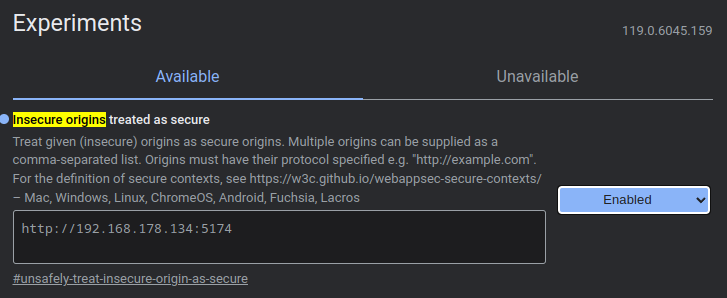
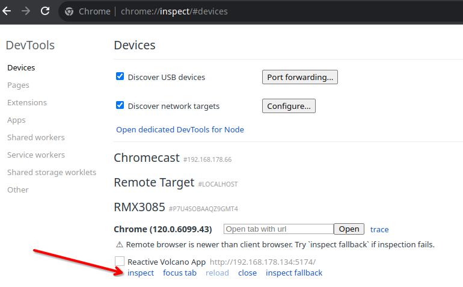

# Development

Everything you need to work on the app: setup, scripts, project layout, conventions, translations,
adding a device and debugging on a phone.

## Contents

- [Requirements](#requirements)
- [Setup](#setup)
- [Scripts](#scripts)
- [Project structure](#project-structure)
- [Conventions](#conventions)
- [Translations](#translations)
- [UI components](#ui-components)
- [Adding a setting or feature](#adding-a-setting-or-feature)
- [Adding a device](#adding-a-device)
- [Working without a device](#working-without-a-device)
- [Debugging on Android](#debugging-on-android)
- [Updating screenshots](#updating-screenshots)

## Requirements

- **Node.js 22** or newer and npm.
- **Chrome or Edge** for Web Bluetooth (see [Getting started](getting-started.md#browsers)), plus a
  compatible device for real-world testing. Most work can be done against the
  [Bluetooth mock](#working-without-a-device).
- Optional: Docker, to test the production image.

## Setup

```bash
git clone https://github.com/firsttris/reactive-volcano-app.git
cd reactive-volcano-app
npm install
npm run dev
```

The dev server listens on all interfaces (`vite --host`) at port **5173**. `http://localhost:5173` is a
secure context, so Web Bluetooth works there. For another device on your network see
[Debugging on Android](#debugging-on-android).

## Scripts

| Script | What it does |
|---|---|
| `npm run dev` | Vite dev server with hot reload |
| `npm run build` | type check + production build for GitHub Pages (base `/reactive-volcano-app/`) into `dist/` |
| `npm run build:root` | the same with base `/` (Docker, own domain) |
| `npm run preview` | serves `dist/` locally |
| `npm run typecheck` | compiles the messages, then `tsc --noEmit` |
| `npm run lint` / `lint:fix` | Biome: lint, format and import order |
| `npm test` | unit tests (Vitest) |
| `npm run test:watch` / `test:ui` / `test:coverage` | Vitest in watch mode, with UI, with coverage |
| `npm run test:e2e` | end-to-end tests (Playwright, starts the dev server) |
| `npm run test:e2e:ui` / `test:e2e:debug` / `test:e2e:report` | Playwright UI mode, debugger, last report |
| `npm run screenshots` | renders the images in `docs/` ([below](#updating-screenshots)) |
| `npm run i18n` | compiles `messages/*.json` into `src/paraglide` |
| `npm run release:patch` / `minor` / `major` | bumps the version, tags and pushes ([Releases](releases.md)) |

Before a pull request: `npm run typecheck && npm run lint && npm test && npm run test:e2e`.

## Project structure

```
src/
  index.tsx                 entry: app-wide providers, mounts the router
  Router.tsx                route tree
  routes.ts                 route constants (ROUTES) and typed builders (buildRoute)
  Views/                    one view per device screen (control, settings)
  components/               shared and device-specific components
    ui/                     solid-ui primitives (button, card, switch, slider …)
    volcano/ crafty/ veazy-venty/
    TemperatureGauge.tsx …  shared device widgets
  provider/                 context providers: Bluetooth, per device, workflows, theme, toasts
  devices/
    shared/                 characteristic device core, debounced writer, analysis types
    volcano/ crafty/ ventyVeazy/
      protocol.ts           pure parse / encode / analysis   (+ protocol.test.ts)
      driver.ts             GATT access                      (+ driver.test.ts)
      store.ts              reactive state and actions
  hooks/                    workflows, IndexedDB, wake lock
  utils/                    UUIDs, Bluetooth queue, heat progress, workflow data
  css/main.css              Tailwind entry and design tokens (light / dark)
  paraglide/                generated messages (git-ignored)
messages/en.json, de.json   translations
project.inlang/             Paraglide project settings
tests/                      cross-cutting tests (translations)
e2e/                        Playwright tests and the Web Bluetooth mock
scripts/                    screenshot renderer
public/                     icons and static files
docs/                       this documentation and its images
```

The layering behind `devices/` is explained in [Architecture](architecture.md#layers).

## Conventions

- **TypeScript strict**, no `any` in new code. Device values are typed end to end, from the protocol
  parser to the store.
- **Biome** formats and lints (2 spaces, double quotes, semicolons, trailing commas `es5`, 80 columns,
  sorted imports, Solid rules). Run `npm run lint:fix` before committing.
- **Protocol code stays pure**: no Web Bluetooth, no Solid, no timers in `protocol.ts`. Everything there
  gets a unit test with byte fixtures.
- **All GATT calls go through the queue** that is passed in. Never call `readValue` / `writeValue`
  directly from a component.
- **Routes** only through `ROUTES` and `buildRoute`.
- **UI text** only through Paraglide messages, never hard-coded.
- **Comments** explain *why* (device quirks, protocol oddities), not what the next line does.
- **Commits and pull requests**: one topic per pull request, a short imperative title
  ("Add charge LED switch for Crafty"), description of what and why.

## Translations

Texts live in `messages/en.json` and `messages/de.json`
([Paraglide JS](https://inlang.com/m/gerre34r/library-inlang-paraglideJs), message format plugin).

- Keys follow `area_group_name`, for example `settings_permanentBoost`, `workflow_stepOf`.
- Placeholders use braces: `"workflow_stepOf": "Step {current}/{total}"`.
- Plurals use the message format's `match` syntax, see `workflow_stepCount`.
- Components import `m` and call `m.settings_title()`; the compiler creates one typed function per key.
- `npm run i18n` compiles them to `src/paraglide`; `dev`, `build`, `typecheck` and `test` do that on
  their own.
- `tests/i18n.test.ts` fails when the two files have different keys or placeholders, or when a message
  is not used anywhere in `src/`.

Adding a language: add `messages/<locale>.json` with all keys, add the locale to
`project.inlang/settings.json`, and run the tests.

## UI components

- Primitives in `src/components/ui` come from [solid-ui](https://www.solid-ui.com) (Kobalte underneath)
  and are owned by this repository; adapt them freely.
- Styling with Tailwind utility classes and the tokens from `src/css/main.css`
  (`bg-card`, `text-muted-foreground`, `text-primary`, `bg-primary-soft` …). Do not hard-code colors, so
  light and dark mode keep working.
- Icons from `lucide-solid`, imported per icon (`lucide-solid/icons/thermometer`) to keep the bundle
  small.
- Settings screens are built from `SettingsSection`, `SettingSwitch`, `SettingSlider`, `SettingRow` and
  `InfoRow` in `src/components/Settings.tsx`.

## Adding a setting or feature

Typical path for a new device option, for example a new Venty / Veazy switch:

1. **Protocol**: add the bit or field and an `encode…` function in `protocol.ts`; extend the parser.
   Add unit tests with real byte values.
2. **Store**: add the field to the state and an action that updates optimistically and calls the
   driver (debounced for numbers, immediate for switches).
3. **View**: add a `SettingSwitch` (or similar) in the settings view.
4. **Messages**: add label and description to `en.json` and `de.json`.
5. **Mock and e2e**: if the value is visible on connect, add it to `e2e/helpers/bluetooth-mock.ts` and
   cover it in the device's spec.
6. **Docs**: update [Usage](usage.md), the feature table in both READMEs and, if bytes changed,
   [Bluetooth protocol](protocol.md).

## Adding a device

1. **Protocol**: capture the GATT layout and byte formats for the device and write
   `src/devices/<family>/protocol.ts` with tests. Use only the device's own Bluetooth interface and
   information you are allowed to use; do not copy third-party code (see the [legal notice](legal.md)).
2. **UUIDs and detection**: add services and characteristics to `src/utils/uuids.ts`, a
   `DeviceType`, the advertised name or service to `getDeviceFilters()` and `detectDeviceType()` in
   `BluetoothProvider`.
3. **Driver**: if the device has one characteristic per value, build on `createCharacteristicDevice`;
   for command / response devices follow `ventyVeazy/driver.ts`. Export `connect<Family>(server, queue)`.
4. **Connection**: add a driver signal and a `case` in `connectToDevice()`.
5. **Store and provider**: `store.ts` with state, actions, derived values; a provider that renders only
   while the driver exists.
6. **Routes and views**: constants in `routes.ts`, a shell with `DeviceShell`, control and settings
   views, a `case` in `DeviceRouter`.
7. **Mock and tests**: a device config in the Bluetooth mock and an e2e spec.
8. **Docs**: README tables, [Usage](usage.md), [Bluetooth protocol](protocol.md).

## Working without a device

`e2e/helpers/bluetooth-mock.ts` replaces `navigator.bluetooth` with a simulated device (desktop,
Crafty, Venty or Veazy) including services, characteristics, reads, writes and notifications. It is
used by the end-to-end tests, and the easiest way to explore the UI without hardware is Playwright's UI
mode:

```bash
npm run test:e2e:ui
```

Pick a test, run it, then use the *Pick locator* and timeline views to inspect every step. See
[Testing](testing.md#the-bluetooth-mock).

## Debugging on Android

Phones reach the dev server only over your LAN IP, which is not a secure context. Chrome can be told to
treat it as one:

1. Enable **USB debugging** on the phone and connect it to the computer.
2. On the **phone**, open `chrome://flags/#unsafely-treat-insecure-origin-as-secure`, add
   `http://<your-computer-ip>:5173`, enable it and restart Chrome.
   
3. Start `npm run dev` and open `http://<your-computer-ip>:5173` on the phone.
4. On the computer, open `chrome://inspect/#devices` and click **inspect** next to the tab. You get the
   full DevTools for the page on the phone, including the console with Bluetooth errors.
   

Alternatively use `adb reverse tcp:5173 tcp:5173` and open `http://localhost:5173` on the phone, which is
a secure context without any flag.

## Updating screenshots

All images of the app in `docs/` are rendered from the running app against the Bluetooth mock, in
English, dark mode, at phone size:

```bash
npm run screenshots
```

This runs `scripts/screenshots.spec.ts` with `playwright.screenshots.config.ts` (it starts the dev
server if none is running), writes `docs/screenshot-*.png`, then renders `docs/banner.svg` to
`docs/banner.png` and composes `docs/hero.png`. If Playwright's bundled browser is not installed, point
it at a local Chromium: `CHROMIUM_PATH=/usr/bin/chromium npm run screenshots`.

Edit `docs/banner.svg` by hand for the banner; the PNG is only there because GitHub and Docker Hub
render PNG more reliably.

---

Next: [Testing](testing.md) · [Architecture](architecture.md) · [Documentation index](README.md)
