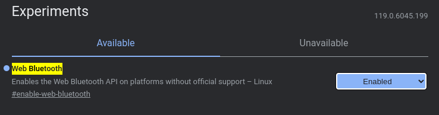

# Getting started

This page takes you from zero to a connected device: which browser to use, the one-time setup on
Linux and iOS, connecting, installing the app on your home screen and how updates reach you.

> [!IMPORTANT]
> This is an unofficial, independent project and not a product of Storz & Bickel GmbH. See the
> [legal notice](legal.md).

## Contents

- [What you need](#what-you-need)
- [Browsers](#browsers)
  - [Linux](#linux)
  - [iOS and iPadOS](#ios-and-ipados)
- [Connecting](#connecting)
- [Install as an app](#install-as-an-app)
- [Updates](#updates)
- [Language and theme](#language-and-theme)

## What you need

- A **compatible device**: Volcano Hybrid, Venty, Veazy or Crafty / Crafty+ (see the
  [feature table](../README.md#-features)). Older Volcano models without Bluetooth (Classic, Digit) cannot
  be controlled.
- A computer, phone or tablet with **Bluetooth Low Energy** (Bluetooth 4.0 or newer).
- A **browser with Web Bluetooth** (below).
- The app itself, either the hosted version at
  **[firsttris.github.io/reactive-volcano-app](https://firsttris.github.io/reactive-volcano-app/)**
  or your [own instance](self-hosting.md).

## Browsers

Web Bluetooth is a Chromium feature. Whether it works depends on browser *and* operating system:

| Platform | Browser | Status |
|---|---|---|
| Android 6+ | Chrome, Edge, Opera | ✅ works out of the box |
| Windows 10+ | Chrome, Edge, Opera | ✅ works out of the box |
| macOS | Chrome, Edge, Opera | ✅ works out of the box; allow Bluetooth for the browser in *System Settings → Privacy & Security → Bluetooth* |
| ChromeOS | Chrome | ✅ works out of the box |
| Linux | Chrome, Chromium | ⚙️ needs a flag, see [Linux](#linux) |
| iOS, iPadOS | Bluefy | ⚙️ see [iOS and iPadOS](#ios-and-ipados) |
| any | Firefox, Safari | ❌ no Web Bluetooth |

The current state for every browser is on
[MDN](https://developer.mozilla.org/docs/Web/API/Web_Bluetooth_API#browser_compatibility). When the app
is opened in a browser without Web Bluetooth, the connect screen says so instead of offering the
button.

### Linux

Chrome on Linux ships Web Bluetooth behind a flag:

1. Open `chrome://flags/#enable-web-bluetooth` (the connect screen has a button that copies the
   address).
2. Set **Web Bluetooth** to *Enabled* and restart Chrome.

Further requirements:

- BlueZ must be running and the adapter powered: `bluetoothctl show` prints `Powered: yes`.
- Use the **native** Chrome or Chromium package. Flatpak and Snap builds often cannot reach BlueZ.
- If the device still does not show up, also enable
  `chrome://flags/#enable-experimental-web-platform-features`.

### iOS and iPadOS

Apple does not allow Web Bluetooth in Safari, and every browser on iOS has to use Safari's engine.
Apps that bring their own Bluetooth bridge work, for example
[Bluefy](https://apps.apple.com/app/bluefy-web-ble-browser/id1492822055). Open the app URL in Bluefy
and connect as usual.

An app added to the home screen *from Safari* cannot use Bluetooth. Use Bluefy's own bookmark instead.

## Connecting

1. **Switch the device on.** It must be advertising: a device that is still connected to another phone
   or app (for example the manufacturer's app) is invisible to everyone else. Disconnect it there or
   turn off Bluetooth on that phone.
2. Open the app and tap **Connect Device**.
3. The browser shows its own dialog with the devices it found. Pick yours. The app only asks for
   devices whose name starts with `STORZ&BICKEL`, `Storz&Bickel` or `S&B`, or that offer one of the
   known Bluetooth services, so nothing else appears.
4. The app detects the device type from its name and opens the matching screen: the desktop control
   with workflows, or the portable control with boost modes and battery.

Connections are not remembered between visits: browsers require a tap on *Connect* each time, so no
web page can connect to your device without you knowing.

Use the power button in the header to disconnect. If the connection drops (out of range, device
switched off), the app returns to the connect screen and tells you the connection was lost.

## Install as an app

The app is a Progressive Web App (PWA). Installed, it starts from your home screen or app launcher in
its own window, without the browser's address bar, and starts even without a network connection.

| Platform | How |
|---|---|
| Android (Chrome) | menu **⋮** → *Add to Home screen* / *Install app* |
| Windows, macOS, Linux, ChromeOS (Chrome, Edge) | the install icon at the right of the address bar, or menu → *Install Reactive Volcano App* |
| iOS (Bluefy) | Bluefy's bookmark / home screen function. Do **not** install from Safari, see [above](#ios-and-ipados) |

## Updates

There is nothing to update by hand. The app looks for a new version when it is opened or brought to the
front, and every hour while it stays open. Without a connected device it switches right away; while a
device is connected it asks first (*Reload*), since reloading ends the Bluetooth connection. A self-hosted container is updated by pulling a new image,
see [Self-hosting](self-hosting.md#updates).

## Language and theme

- **Language**: English or German, chosen from your browser's preferred languages. Every other
  language falls back to English.
- **Theme**: light or dark, following your system until you switch it with the sun / moon button in the
  header. Your choice is remembered in this browser.

---

Next: [Usage](usage.md) · [Troubleshooting](troubleshooting.md) · [Documentation index](README.md)
