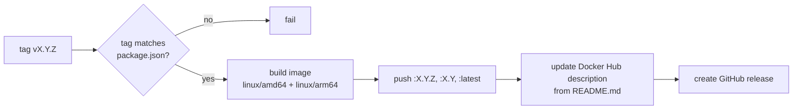

# Releases & deployment

The app is delivered two ways: the hosted web app on GitHub Pages, updated on every push to `main`, and
versioned Docker images on Docker Hub, published from tags.

## Contents

- [GitHub Pages](#github-pages)
- [Versioning](#versioning)
- [Cutting a release](#cutting-a-release)
- [What the release workflow does](#what-the-release-workflow-does)
- [Edge images](#edge-images)
- [Required secrets](#required-secrets)
- [Checklist](#checklist)

## GitHub Pages

| | |
|---|---|
| URL | https://firsttris.github.io/reactive-volcano-app/ |
| Workflow | [`.github/workflows/build.yml`](../.github/workflows/build.yml) |
| Trigger | push to `main` (except changes to `README.md` only), or by hand |
| Build | `npm run build` with base `/reactive-volcano-app/` |
| SPA fallback | `dist/index.html` is copied to `dist/404.html`, so deep links survive a reload |

Unit and end-to-end tests must pass before the build and deployment run
([Continuous integration](testing.md#continuous-integration)). Users receive the new version through the
service worker the next time they open the app.

## Versioning

The version in `package.json` follows [Semantic Versioning](https://semver.org/):

- **patch**: fixes, translations, documentation-visible tweaks,
- **minor**: new features or device support,
- **major**: changes that break something for users, for example dropping a device or changing the
  workflow file format.

## Cutting a release

```bash
git checkout main && git pull
npm run release:minor     # or release:patch / release:major
```

`npm version` bumps `package.json` and `package-lock.json`, commits, creates the tag `vX.Y.Z`, and
the `postversion` script pushes the commit and the tag.

## What the release workflow does

[`.github/workflows/release.yml`](../.github/workflows/release.yml) runs on tags `v*` and calls the shared
[`docker-release`](https://github.com/firsttris/workflows) workflow:



- The image is built from the [`Dockerfile`](../Dockerfile) (`npm ci`, `npm run build:root`, nginx).
- The Docker Hub description is taken from `README.md` with relative links made absolute, so the README
  and its images render there too. The short description is set in `release.yml` (max. 100 characters).

## Edge images

Running the release workflow by hand on `main` (*Actions → Release → Run workflow*) publishes the image
as `:edge` without creating a release. Use it to test a container build before tagging.

## Required secrets

Set in the repository or organization settings, used by the shared workflow:

| Secret | Purpose |
|---|---|
| `DOCKER_PAT` | Docker Hub access token with write access for the user `tristanteu` (passed through `secrets: inherit`) |

The GitHub release uses the workflow's own `GITHUB_TOKEN` (`contents: write`). GitHub Pages must be set to
*GitHub Actions* as the source under *Settings → Pages*.

## Checklist

Before tagging:

- [ ] `npm run typecheck && npm run lint && npm test && npm run test:e2e` pass
- [ ] tested on at least one real device per changed family ([checklist](testing.md#testing-on-a-real-device))
- [ ] screenshots updated if the UI changed (`npm run screenshots`)
- [ ] README feature table and docs updated
- [ ] both translations complete (the i18n test enforces this)

---

Next: [Self-hosting](self-hosting.md) · [Development](development.md) · [Documentation index](README.md)
