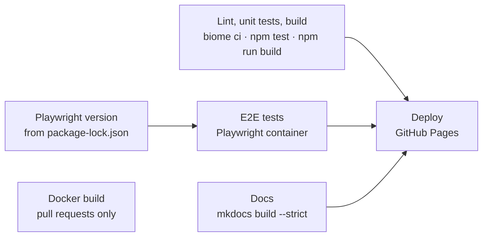

# Testing

Three levels, all runnable without a device: unit tests for the protocol and logic, end-to-end tests of
the whole app against a simulated Web Bluetooth stack, and checks on types, lint and translations.

## Contents

- [Overview](#overview)
- [Unit tests](#unit-tests)
- [End-to-end tests](#end-to-end-tests)
- [The Bluetooth mock](#the-bluetooth-mock)
- [Static checks](#static-checks)
- [Continuous integration](#continuous-integration)
- [Testing on a real device](#testing-on-a-real-device)

## Overview

| Level | Tool | Where | Run |
|---|---|---|---|
| Unit | Vitest | `src/**/*.test.ts`, `tests/` | `npm test` |
| End-to-end | Playwright (Chromium) | `e2e/*.spec.ts` | `npm run test:e2e` |
| Types | TypeScript | everything in `src/` | `npm run typecheck` |
| Lint / format | Biome | whole repository | `npm run lint` |

## Unit tests

| File | Covers |
|---|---|
| `devices/volcano/protocol.test.ts` | parsing and encoding, register bits, set / clear writes, analysis |
| `devices/crafty/protocol.test.ts` | parsing, °F target conversion, firmware variants, analysis |
| `devices/ventyVeazy/protocol.test.ts` | every frame type with byte fixtures, write masks, Veazy inversions, analysis |
| `devices/*/driver.test.ts` | drivers against fake characteristics: init sequence, notifications, polling, queued writes, dispose |
| `devices/shared/debouncedWriter.test.ts` | debounce, hold window, newer value during a pending write (with a fake clock) |
| `utils/bluetoothUtils.test.ts`, `utils/heatProgress.test.ts` | helpers, heat status, progress and time-to-target |
| `hooks/utils/useIndexedDB.test.ts` | the IndexedDB hook against an in-memory mock |
| `tests/i18n.test.ts` | same keys and placeholders in English and German, every message used, every used key defined |

Drivers take the Bluetooth queue and characteristics as parameters, so tests pass fakes and assert the
exact bytes written:

```ts
// src/devices/ventyVeazy/driver.test.ts (shortened)
class FakeCharacteristic extends EventTarget implements ControlCharacteristic {
  written: number[][] = [];
  async writeValue(value: BufferSource) {
    this.written.push([...new Uint8Array(value as ArrayBuffer)]);
  }
  notify(bytes: number[]) { /* sets value, dispatches characteristicvaluechanged */ }
}

const driver = createVentyVeazyDriver(characteristic, "VENTY", new PQueue({ concurrency: 1 }));
await driver.start();
expect(characteristic.commands()).toEqual([0x02, 0x1d, 0x01, 0x04, 0x05, 0x06]);
```

```bash
npm test                 # once
npm run test:watch       # on change
npm run test:coverage    # with a v8 coverage report in coverage/
```

## End-to-end tests

Playwright starts the dev server (`npm run dev`, port 5173) and runs the specs in Chromium:

| Spec | Covers |
|---|---|
| `app.spec.ts` | loading, connect screen without a device, navigation, mobile / tablet / desktop sizes, German locale |
| `volcano.spec.ts` | connect, navigation, temperature controls, heater, disconnect |
| `venty-veazy.spec.ts` | connect and navigation for both models, temperature display |
| `crafty.spec.ts` | connect, navigation, temperature display |

```bash
npm run test:e2e          # headless
npm run test:e2e:ui       # interactive UI mode
npm run test:e2e:debug    # step through with the inspector
npm run test:e2e:report   # open the last HTML report
```

In CI tests retry twice and record a trace on the first retry; the HTML report is uploaded as an
artifact.

## The Bluetooth mock

`e2e/helpers/bluetooth-mock.ts` injects a fake `navigator.bluetooth` before the app loads
(`page.addInitScript`). It simulates the desktop, Crafty, Venty and Veazy with their services,
characteristics, initial values, reads, writes and notification listeners. Use it through the fixture:

```ts
import { expect, test } from "./helpers/fixtures";

test("shows the target temperature", async ({ page, bluetoothDevice }) => {
  await bluetoothDevice("VOLCANO");
  await page.goto("/");
  await page.getByRole("button", { name: "Connect Device" }).click();
  await expect(page.getByText("Target Temperature")).toBeVisible();
});
```

`requestDevice` resolves immediately with the configured device, as if the user had picked it in the
chooser. Writes update the stored value, so a later read returns it. More details in
[`e2e/README.md`](../e2e/README.md).

## Static checks

- `npm run typecheck`: TypeScript in strict mode, after compiling the messages so missing keys are type
  errors.
- `npm run lint`: Biome's recommended rules plus the Solid domain (for example reactivity mistakes),
  formatting and import order.

## Continuous integration

`.github/workflows/build.yml` runs on every pull request, on every push to `main` and by hand:



- **Lint, unit tests, build** run in one job. Biome reports problems as annotations in the pull request
  diff; the build includes the type check.
- **E2E tests** run in the official Playwright container. Its tag is read from `package-lock.json`, so
  updating `@playwright/test` never leaves the container behind. Failures show up as annotations; the
  HTML report is attached to failed runs.
- **Docs** builds the website from `docs/` with MkDocs Material (`mkdocs.yml`). `--strict` fails on a
  broken link or anchor, including links between the pages, so a pull request catches them before they
  are published.
- **Docker build** (pull requests only) builds the image without pushing it, so a broken `Dockerfile`
  shows up before a release.
- **Deploy** only runs for `main`, after the checks, E2E tests and docs passed: the app and, under
  `/docs/`, the documentation website ([Releases & deployment](releases.md#github-pages)).

A new push to a pull request cancels its outdated run. Changes to the README files, `CONTRIBUTING.md` or
`LICENSE` alone trigger nothing. Releases are described in [Releases & deployment](releases.md).

## Testing on a real device

The mock cannot catch timing issues, firmware quirks or browser differences. Before a release, or after
touching a driver, check on hardware:

- connect, disconnect, reconnect; switch the device off while connected (*Connection lost*),
- change the target quickly with + / − and watch it settle on the last value,
- every switch in the settings, then reconnect and check it stuck,
- a full workflow on the desktop, including pause, resume and stop,
- the self-diagnosis,
- light and dark mode, German and English, phone and desktop widths.

Use [remote debugging](development.md#debugging-on-android) to see the console on a phone.

---

Next: [Releases & deployment](releases.md) · [Development](development.md) · [Documentation index](README.md)
