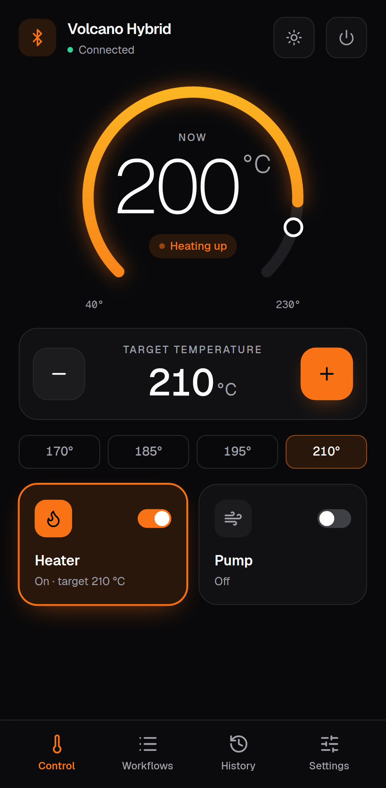
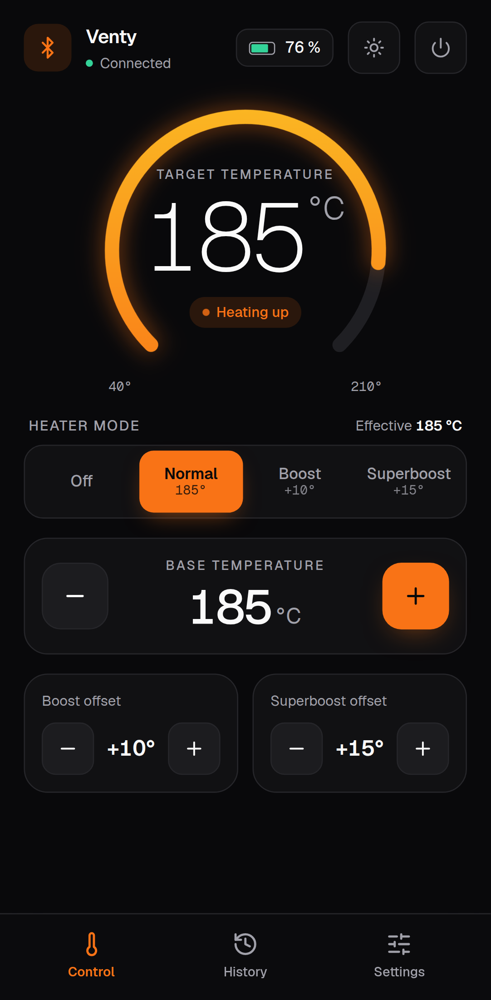
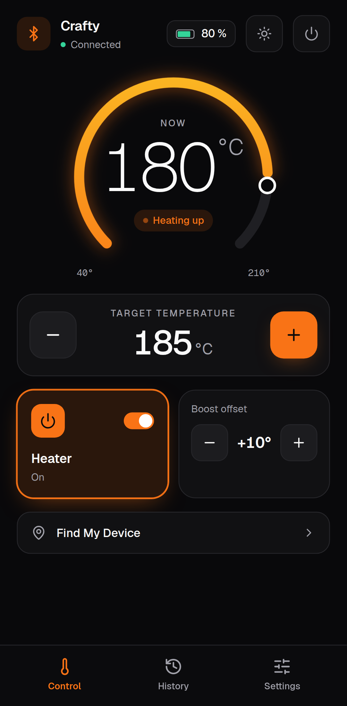

# Usage

What every screen does, per device family. Device names are used only to describe compatibility; this
is an unofficial app, see the [legal notice](legal.md).

## Contents

- [Common to all devices](#common-to-all-devices)
- [Desktop: Volcano Hybrid](#desktop-volcano-hybrid)
- [Portable: Venty and Veazy](#portable-venty-and-veazy)
- [Portable: Crafty and Crafty+](#portable-crafty-and-crafty)
- [Self-diagnosis](#self-diagnosis)
- [How values are written](#how-values-are-written)

## Common to all devices

**Header.** Device name and connection state on the left. On the right: the battery level (portables),
the light / dark switch and the disconnect button, which asks before it disconnects.

**Temperature gauge.** The large number is the *current* temperature reported by the device. The arc
fills from 40 °C to the device's maximum, the white marker sits at the target. Below it a status chip
says what is happening:

| Chip | Meaning |
|---|---|
| *Heater off* | the heater is switched off |
| *Heating up* | heater on, current temperature below the target; with an estimate of the remaining time once the rate is known |
| *Cooling down* | heater on, current temperature more than 2° above the target |
| *Temperature reached* | within ±2° of the target |

The Venty and Veazy do not report their current temperature. For them the gauge shows the *target*
(including boost), and the chip relies on the heater mode and the device's own "temperature reached"
signal: *Heater off*, *Heating up* or *Temperature reached*, without a remaining time. The live
temperature curve is only shown for the Volcano and the Crafty.

**Screen stays on.** While the heater is on or a workflow runs, the app holds a
[screen wake lock](https://developer.mozilla.org/docs/Web/API/Screen_Wake_Lock_API) so your phone does
not lock in the middle of a session. It is released as soon as the heater is off.

**Units.** Temperatures are shown in the unit the device is set to (°C or °F). Change it under
*Settings → Temperature unit*; the device itself switches too.

**Bottom navigation.** *Control* and *Settings* on every device, plus *Workflows* on the desktop.

## Desktop: Volcano Hybrid

### Control

- **Target temperature**: − / + in 1° steps, held down to repeat, or one of the presets 170°, 185°,
  195° and 210°. Range 40–230 °C.
- **Heater**: switches heating on or off; the card shows the target while it is on.
- **Pump**: switches the air pump on or off.

### Workflows

Automated sessions: heat to a temperature, hold, run the pump, next step. Run, pause, resume and stop
them, edit their steps, import and export them as JSON. While a workflow runs, a bar at the bottom of
every screen shows the current step and phase. Everything about workflows is on its own page:
**[Workflows](workflows.md)**.

### Settings

| Setting | What it does |
|---|---|
| Automatic shutdown time | minutes until the device switches itself off after the last use |
| Device brightness | display brightness, 0–100 % |
| Vibration | haptic feedback, e.g. when the target is reached |
| Standby light | show the temperature on the display while cooling down |
| Temperature unit | °C or °F, on the device and in the app |
| Device runtime | total heating time, hours and minutes |
| Serial number, firmware | as reported by the device |
| Start analysis | [self-diagnosis](#self-diagnosis) |

## Portable: Venty and Veazy

### Control

- **Heater mode**: *Off*, *Normal*, *Boost* or *Superboost*. *Effective* shows the temperature the
  device is heading for in the selected mode: base temperature plus the boost or superboost offset.
- **Base temperature**: − / + in 1° steps, range 40–210 °C.
- **Boost offset / Superboost offset**: how many degrees boost and superboost add on top of the base
  temperature.

When a Veazy is switched off with *Find my device* active, the control screen shows only a button that
makes it beep, and a hint how to switch it on again.

### Settings

| Setting | What it does |
|---|---|
| LED brightness | 1–9 |
| Vibration | haptic feedback |
| Temperature unit | °C or °F |
| Permanent Bluetooth *(Veazy)* | keeps Bluetooth on while the device is off. Drains the battery faster |
| Boost & superboost visualization | LED animation while boosting |
| Permanent boost | disables the 90-second timeout of boost and superboost |
| Charge current optimization (eco) | charges more slowly, which is easier on the battery |
| Charge voltage limit (eco) | charges to a lower voltage: longer battery life, less capacity per charge |
| Device info | serial number, runtime, battery charging time, firmware, bootloader |
| Locate device *(Veazy)* | makes the device beep and blink |
| Start analysis | [self-diagnosis](#self-diagnosis) |
| Factory reset | resets the device settings, after a confirmation |

## Portable: Crafty and Crafty+

### Control

- **Target temperature**: − / + in 1° steps, range 40–210 °C.
- **Heater**: on or off.
- **Boost offset**: degrees added when boost is used on the device.
- **Find my device** *(Crafty+)*: the device beeps and blinks for 30 seconds.
- Once the target is reached, a countdown shows when the device will switch itself off.

### Settings

| Setting | What it does |
|---|---|
| Device brightness | LED brightness |
| Automatic shutdown time | time until the device switches itself off |
| Vibration | haptic feedback |
| Permanent Bluetooth | keeps Bluetooth on. Drains the battery faster |
| Charge indicator lamp | show the charging state with the LED |
| Device info | battery, runtime, serial number, firmware, Bluetooth firmware |
| Start analysis | [self-diagnosis](#self-diagnosis) |
| Factory reset | after a confirmation |

**Older firmware.** A Crafty with firmware older than 2.51 lacks most of the Bluetooth values. The app
detects it, shows a notice and offers what the device supports: target and current
temperature, boost, brightness and battery. The heater switch is not available on these units.

## Self-diagnosis

*Settings → Start analysis* reads the device's status registers and turns them into plain advice, for
example *Please let the device cool down*, *Please charge the device* or *Vibration is disabled*.
Settings that are fine but unusual (eco charging, permanent Bluetooth, low brightness) are listed as
hints.

If the device reports an actual error, the app shows an **error report**: a short block with the
serial number and the raw register values, meant for the manufacturer's support. The app never sends it
anywhere itself; pass it on yourself if you contact support. The analysis is an aid, not a repair tool and not an official diagnosis.

## How values are written

- **Buttons and sliders that change a number** (temperature, offsets, brightness, shutdown time) update
  the screen at once and write to the device 300 ms after your last change (500 ms on Venty / Veazy). Ten taps on +
  become one Bluetooth write. For 1 s after the write (1.5 s on Venty / Veazy), values coming back from the device do not overwrite
  what you see, so the number does not jump back while the device catches up.
- **Switches** (heater, pump, vibration …) are written immediately and confirmed by the device's next
  notification.
- **All Bluetooth operations run one after another** through a single queue. Nothing is lost when you
  tap quickly; it just runs in order.

Details: [Architecture](architecture.md#writing-values).

---

Next: [Workflows](workflows.md) · [Troubleshooting](troubleshooting.md) · [Documentation index](README.md)
