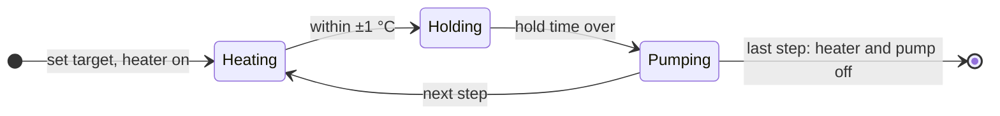

# Workflows

Workflows automate a session on the desktop device (Volcano Hybrid): a list of steps, each one
heating to a temperature, optionally holding it, then running the air pump. They are stored in your
browser and can be shared as JSON files.


## Contents

- [How a workflow runs](#how-a-workflow-runs)
- [Running, pausing, stopping](#running-pausing-stopping)
- [Managing workflows](#managing-workflows)
- [Built-in examples](#built-in-examples)
- [File format](#file-format)
- [Where workflows are stored](#where-workflows-are-stored)
- [Safety](#safety)

## How a workflow runs

Each step has three values:

| Field | Unit | Meaning |
|---|---|---|
| Temperature | °C | target for this step (40–230) |
| Hold time | seconds | how long to wait once the temperature is reached, before pumping (0 = pump at once) |
| Pump time | seconds | how long the air pump runs (at least 0.5 s) |

For every step the app

1. sets the target temperature,
2. waits 0.75 s and switches the heater on if it is off,
3. checks the current temperature every 1.5 s until it is within **±1 °C** of the target,
4. waits the hold time,
5. switches the pump on, waits the pump time and switches it off again.

Then the next step starts. After the last step, the heater and the pump are switched off.



## Running, pausing, stopping

- **Start**: the ▶ button on a workflow. A bar at the bottom of every screen shows *Step 3/11*, the
  phase (*Heating to 180°*, *Holding*, *Pumping*) and the time left in that phase.
- **Pause**: interrupts the current step at once and switches the pump off. The heater stays on.
- **Resume**: repeats the interrupted step from its beginning.
- **Stop**: ends the workflow and switches heater and pump off.

The screen stays on while a workflow runs. The workflow runs **in the app**, not on the device: if
you close the tab, lock the phone hard enough that the browser suspends the page, or the Bluetooth
connection drops, the workflow stops where it is. Heater and pump stay in their last state on the
device, which then follows its own auto-shutdown.

## Managing workflows

- **New**: creates an empty workflow; add steps with *Add*.
- **⋯ menu** on a workflow: rename, edit steps, export, delete. Deleting can be undone from the
  notification that appears.
- **Edit steps**: each step opens a form with temperature, hold time and pump time.
- **Import & export** (the download button next to *New*):
  - *Export workflow*: one workflow as `<name>_workflow.json`.
  - *Import single workflow*: adds the workflow from such a file.
  - *Export all workflows*: everything as `all_workflows_<date>.json`.
  - *Import all workflows*: **replaces** all existing workflows with the ones from the file, after a
    confirmation.

## Built-in examples

On first start the app creates four workflows you can change or delete:

| Name | Steps |
|---|---|
| Ballon | 170 → 220 °C in 5° steps, 5 s pump each (11 steps) |
| workflow2 | 182, 192, 201, 220 °C |
| workflow3 | 175 → 195 °C in 5° steps |
| workflow4 | 174, 199, 213, 222 °C |

## File format

Files are plain JSON. IDs are not exported; every import gets fresh ones, so importing the same file
twice gives two independent copies.

**One workflow** (`Export workflow`):

```json
{
  "name": "Evening",
  "workflowSteps": [
    { "temperature": 175, "holdTimeInSeconds": 0, "pumpTimeInSeconds": 8 },
    { "temperature": 185, "holdTimeInSeconds": 10, "pumpTimeInSeconds": 8 },
    { "temperature": 195, "holdTimeInSeconds": 10, "pumpTimeInSeconds": 10 }
  ],
  "exportedAt": "2026-10-04T18:00:00.000Z",
  "version": "1.0"
}
```

**All workflows** (`Export all workflows`):

```json
{
  "workflows": [
    { "name": "Evening", "workflowSteps": [ … ] },
    { "name": "Ballon", "workflowSteps": [ … ] }
  ],
  "exportedAt": "2026-10-04T18:00:00.000Z",
  "version": "1.0",
  "totalWorkflows": 2
}
```

Rules on import:

- `name` must be present, `workflowSteps` must be an array.
- `temperature`, `holdTimeInSeconds` and `pumpTimeInSeconds` must be numbers in every step.
- `exportedAt`, `version` and `totalWorkflows` are informational and ignored.
- Temperatures outside 40–230 °C are clamped to that range when the step runs.

A file that breaks a rule is rejected as a whole with *Invalid workflow file*; nothing is changed.

## Where workflows are stored

In the browser's IndexedDB (database `VolcanoWorkflowDB`, store `keyValueStore`, keys `workflowList`
and `selectedWorkflowId`). They stay on this device and in this browser profile: another browser,
another phone or a private window starts with the examples. Use export / import to move them.
Clearing the site data in the browser deletes them. See [Privacy & security](privacy-security.md).

## Safety

A workflow switches a heating device on and off automatically. Stay with the device while a workflow
runs, keep the manufacturer's instructions in mind and stop the workflow if anything looks wrong. See
the [legal notice](legal.md#safety-and-intended-use).

---

Next: [Usage](usage.md) · [Architecture](architecture.md#workflows) · [Documentation index](README.md)
